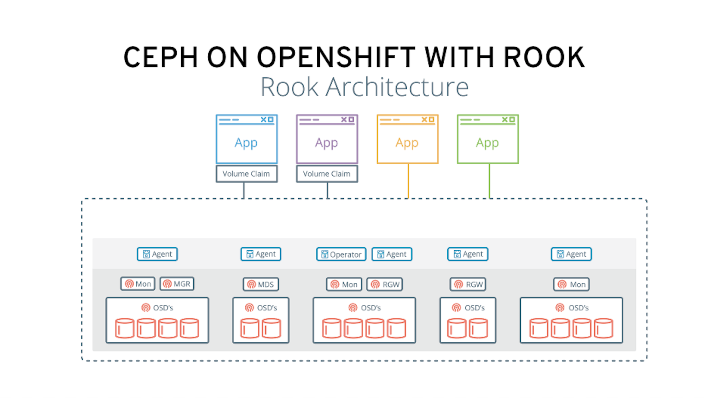
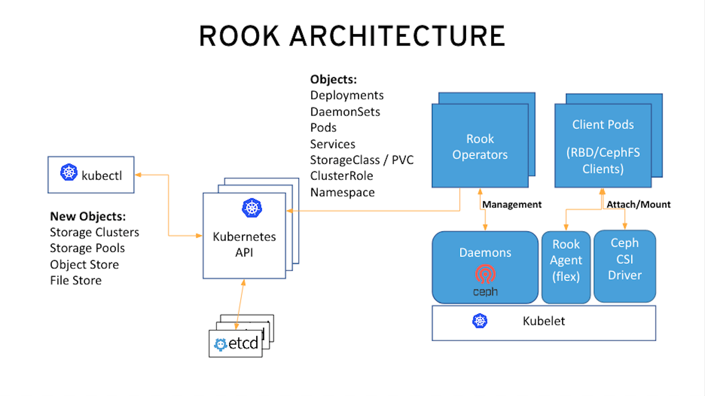

= Lab: Deploying and Managing OpenShift Container Storage with Rook-Ceph Operator

== Lab Overview

.Ceph deployed on OpenShift using Rook

This hands-on workshop is for both system administrators and application developers interested in learning how to deploy and manage OpenShift Container Storage (OCS). In this lab you will be using OpenShift Container Platform (OCP) 4.x and Rook to deploy Ceph as a persistent storage solution for OCP workloads.

.Goals

* Download and configure the OpenShift installer
* Configure the OpenShift Container Platform cluster
* Configure and deploy containerized Ceph using Rook’s cluster CustomResourceDefinitions (CRD)
* Validate deployment of Ceph Mimic containerized using OpenShift CLI
* Deploy the Rook toolbox to run cn ceph and rados commands
* Create a Persistent Volume (PV) on the Ceph cluster using a Rook OCP StorageClass for deployment of Rails application using a PostgreSQL database.
* Upgrade Ceph version from Mimic to Nautilus using the Rook operator
* Add more storage to the Ceph cluster

.Provisioned Environment Hosts

* Bastion host: `bastion.$GUID.$SANDBOX.opentlc.com`, `clientvm.$GUID.internal`

[[labexercises]]
:numbered:

== Provision Lab Environment

[NOTE]
If you previously set up an environment for this class, you can skip this section and go directly to the <<labexercises>> section.

In this section, you provision the lab environment to provide access to all of the components required to perform the labs. The lab environment is a shared cloud-based environment, so that you can access it over the Internet from anywhere. However, do not expect performance to match a dedicated environment.

. Go to the {opentlc_portal} and use your OPENTLC credentials to log in.
+
[TIP]
If you do not remember your password, go to the {opentlc_account_management} to reset your password.

. Navigate to *Services -> Catalogs -> All Services -> {opentlc_catalog_name1}*.
. On the left, select *{opentlc_catalog_item_name1}*.
. On the right, click *Order*.
. If the interface offers it to you, and you are not in North America, click *Lab Parameters* and select your appropriate region.
. On the bottom right, click *Submit*.
+
[WARNING]
Do not select *App Control -> Start* after ordering the lab. Ordering the lab automatically begins the build process. Selecting *Start* may corrupt the lab environment or cause other complications.

* After a few minutes, expect to receive an email with instructions on how to connect to the environment.
. You will receive three e-mails:
+
.Provisioning started
[source,texinfo]
----
Provisioning has started on your Red Hat OPENTLC OTLC-LAB-<OpenTLC User Name>-PROD_OCP4_HA_LAB-<GUID> environment.
You will receive more information via email during the build process within the next 30 minutes.
----
+
.Provisioning has updated (this means that the VMs have been requested successfully)
[source,texinfo]
----
Provisioning is continuing for Red Hat OPENTLC service OTLC-LAB-<OpenTLC User Name>-PROD_OCP4_HA_LAB-<GUID>.
You will receive another email when the environment is available within the next 30 minutes.
----
+
.Provisioning completed
[source,texinfo]
----
Your environment for OTLC-LAB-<OpenTLC User Name>-PROD_OCP4_HA_LAB-<GUID>>_COMPLETED has been provisioned.
Your unique identifier, GUID, is: <GUID>>

Access to the environment will be granted as soon as the environment deployment is complete.

Please refer to your demo instructions for next steps and how to access your environment.

Troubleshooting and Access issues:

Always refer to your lab instructions to understand how to properly access and navigate your environment. If you need help using the SSH client on your computer you can consult http://www.opentlc.com/ssh.html.

NOTICE: Your environment will expire and be deleted in 7 day(s) at 2019-03-27 00:00:00 -0400 and will be idled down after 8 hour(s).

In order to conserve resources, we cannot archive or restore any data in this environment. All data will be lost upon expiration.
---

Here is some important information about your environment:

Top level domain: .sandbox999.opentlc.com

WARNING: with great power comes great responsibility. We monitor usage.
Your AWS programmatic access:
aws_access_key_id = < AWS ACCESS KEY >
aws_secret_access_key = < AWS SECRET ACCESS KEY >

SSH Access: ssh <OpenTLC User Name>@bastion.<GUID>.sandbox999.opentlc.com
SSH password: < SSH PASSWORD >
---
----
+
. Wait until you receive the final e-mail before trying to connect to your environment.
. Note the GUID (a 4 character ID) of your environment.
. Note the Top Level domain (`sandbox999.opentlc.com` in the example above)
. Note the command to SSH into your bastion.
. Note the AWS Access credentials provided for the duration of this lab.
. Finally note the SSH password for your user id. *This password is different from your regular OpenTLC password!*

=== Start Environment After Shut Down

To conserve resources, the lab environment shuts down automatically after eight hours. In this section, you restart the lab environment for this course after it has shut down automatically.

. Go to the {opentlc_portal} and use your OPENTLC credentials to log in.
. Navigate to *Services -> My Services* (this should be the screen shown right after logging in).
. In the list of your services, select your lab environment.
. Select *App Control -> Start* to start your lab environment.
. Select *Yes* at the *Are you sure?* prompt.
. On the bottom right, click *Submit*.

After a few minutes, expect to receive an email letting you know that the lab environment has been started.

=== Test Server Connections

The `bastion` administration host serves as an access point into the environment and is not part of the OpenShift environment.

. Connect to your administration host and make sure you can access each of your provisioned hosts:
+
----
ssh <OpenTLC User Name>@bastion.<GUID>.sandbox<SANDBOXID>.opentlc.com
----
+
. Validate that the GUID variable is set correctly for your environment:
+
[source,sh]
----
echo $GUID
----
+
.Sample Output
[source,texinfo]
----
c3po
----

== Configure Bastion VM to Run OpenShift Installer

In this section, you prepare the bastion VM to install OpenShift Container Platform. This includes installing the AWS Command Line Interface, the OpenShift Installer, and the OpenShift CLI.

[TIP]
Simple instructions and access credentials are available at link:https://cloud.openshift.com/clusters/install[https://cloud.openshift.com/clusters/install^].

=== Set Up Installation Prerequisites

. Connect to your bastion instance using the information provided in the final provisioning email.
+
TIP: The bastion host is also called `workstation`.

. Switch to `root` using the `sudo` command and save your GUID to `.bashrc`:
+
[source,sh]
----
sudo -i
export GUID=`hostname | awk -F. '{print $2}'`
echo "GUID=${GUID}" >>$HOME/.bashrc
----

. Install the AWS CLI tools:
+
[source,sh]
----
# Download the latest AWS Command Line Interface
curl "https://s3.amazonaws.com/aws-cli/awscli-bundle.zip" -o "awscli-bundle.zip"
unzip awscli-bundle.zip

# Install the AWS CLI into /bin/aws
./awscli-bundle/install -i /usr/local/aws -b /bin/aws

# Validate that the AWS CLI works
aws --version

# Clean up downloaded files
rm -rf /root/awscli-bundle /root/awscli-bundle.zip
----
+
[NOTE]
While the OpenShift installer does not need these tools, you use them later to verify your credentials and list created AWS resources.

. Get the OpenShift installer binary:
+
[source,sh]
----
OCP_VERSION=4.1.0
wget https://mirror.openshift.com/pub/openshift-v4/clients/ocp/${OCP_VERSION}/openshift-install-linux-${OCP_VERSION}.tar.gz
tar zxvf openshift-install-linux-${OCP_VERSION}.tar.gz -C /usr/bin
rm -f openshift-install-linux-${OCP_VERSION}.tar.gz /usr/bin/README.md
chmod +x /usr/bin/openshift-install
----

. Get the `oc` CLI tool:
+
[source,sh]
----
wget https://mirror.openshift.com/pub/openshift-v4/clients/ocp/${OCP_VERSION}/openshift-client-linux-${OCP_VERSION}.tar.gz
tar zxvf openshift-client-linux-${OCP_VERSION}.tar.gz -C /usr/bin
rm -f openshift-client-linux-${OCP_VERSION}.tar.gz /usr/bin/README.md
chmod +x /usr/bin/oc
----

. Check that the OpenShift installer and CLI are in `/usr/bin`:
+
[source,sh]
----
ls -l /usr/bin/{oc,openshift-install}
----
+
.Sample Output
[source,texinfo]
----
-rwxr-xr-x. 2 root root 76609712 May  9 19:20 /usr/bin/oc
-rwxr-xr-x. 1 root root 52164282 May  9 19:17 /usr/bin/openshift-install
----

. Set up bash completion for the OpenShift CLI:
+
[source,sh]
----
oc completion bash >/etc/bash_completion.d/openshift
----

. Press *Ctrl+D* or type `exit` to log out of your `root` shell.

. Set the GUID environment variable for your user ID:
+
[source,sh]
----
export GUID=`hostname | awk -F. '{print $2}'`
echo "export GUID=${GUID}" >>$HOME/.bashrc
----
+
NOTE: This is not required for OpenShift Container Platform, but it does make the lab environment easier to work with.

. Save your provided AWS credentials to the `$HOME/.aws/credentials` file, making sure to replace `YOURACCESSKEY` and `YOURSECRETACCESSKEY` with your individual credentials:

.. Get your AWS credentials from the final lab provisioning email.
.. Optionally, select the AWS region that is closest to your location:
+
IMPORTANT: Do NOT select `us-east-1`.
+
** `us-east-2` (Ohio)
** `us-west-1` (California)
** `eu-central-1` (Frankfurt)
** `ap-southeast-1` (Singapore)
** `sa-east-1` (Sao Paulo)

+
[source,sh]
----
export AWSKEY=<YOURACCESSKEY>
export AWSSECRETKEY=<YOURSECRETKEY>
export REGION=us-east-2

mkdir $HOME/.aws
cat << EOF >>  $HOME/.aws/credentials
[default]
aws_access_key_id = ${AWSKEY}
aws_secret_access_key = ${AWSSECRETKEY}
region = $REGION
EOF
----

. Check to see that your credentials work:
+
[source,sh]
----
aws sts get-caller-identity
----
+
.Sample Output
[source,texinfo]
----
{
    "Account": "067260970738",
    "UserId": "AIDAQ7KIQ63ZDI63CYX52",
    "Arn": "arn:aws:iam::067260970738:user/wkulhane@redhat.com-ba50"
}
----

. Using your browser, go to link:https://try.openshift.com[https://try.openshift.com^], click *Get Started*, and log in with your Red Hat login.
+
[TIP]
If you get an error after logging in, go back to link:https://try.openshift.com[https://try.openshift.com^].

. Ignore all other instructions, scroll down to *Step 4: Deploy the Cluster*, click *Copy Pull Secret* to place the secret in your clipboard, and then save it to a file.
* You paste the pull secret into the prompt of the installer later.
+
.Example Pull Secret
[source,texinfo]
----
{"auths":{"cloud.openshift.com":{"auth":"b3BlbnNoaWZ0LXJlbGVhc2UtZGV2K3JocGRzYWRtaW5zcmVkaGF0Y29tMWZyZ3NpZHV6cTJkem5zajNpdzBhdG1samg3OjJMSTFEVTM1MFVCQks1ODRCTFVBODBFTTUABDDD13RDI0Qko2Q0I5VzNFSFIzS0pSSFhOSFgyVllNMlFFMVQ=","email":"youremail@redhat.com"},"quay.io":{"auth":"b3BlbnNoaWZ0LXJlbGVhc2UtZGV2K3JocGRzYWRtaW5zcmVkaGF0Y29tMWZyZ3NpZHV6cTJkem5zajNpdzBhdG1samg3OjJMSTFEVTM1MFVCQks1ODRCTFVBODBFTTUABDDD13RDI0Qko2Q0I5VzNFSFIzS0pSSFhOSFgyVllNMlFFMVQ=","email":"youremail@redhat.com"},"registry.connect.redhat.com":{"auth":"NTE1NDg0ODB8dWhjLTFGckdzSURVWlEyRHpuU0ozaVcwQXRtTEpoNzpleUpoYkdjaU9pSlNVelV4TWlKOS5leUp6ZFdJaU9pSXpPR1prTVdJNFpqYzJOamcwTmpKbVlXTTRaVFpsWVRnd09EUTJOMkkzTnlKOS5YUmQ5LS1LQ3kzVlpVbF9ldTc0THpQMFEzOVYwRUVfeWRZOE5pVGRScUlyd2hVRHYtcFF2ZEtLV1ZpVmlaQWF0QkhEUVdmVDB1Z2pfTWIzYmNPUktqSXdBNldQTXYxWTc1RmhYQUg1S2Myc3lnSHVxWTRfZlhSOXJnbW42N0l0MmhiUXJyb3BBNXlaYXpXSzhPeTBJb29VWFAteDBPUjZ2VDJTVGktbm5sblBLbEFSWTBEZkxJYmk3OHZlZXFadUpyUDl4SzlXdnRaOEZOREpzQnlUc2VmeFRoVmtLMDVwVDlhTk9nTkxITGJMeU5sdEc1RE9xU1JiZ1hLMDJ6RXNaU3BwYmZLdVAwNVJYQWljQy14WEZiamtLaFpkYTgwV3lnZDJKcTZXWVF3WW83ZXgtLUh1MEpKeXBTczRINVY0Nm50dTNVRlNVUERBZEJ5VmVDU2RxckpzUWZoSmlpLVdJbXdjWnp6LUNwTlRfNVo0ei1WUkc0aV9hVF9TWnVkQzVySmFLdFpHS1RQWlg0SDlNLWxDeFlHZDJNYzhuWlc4NWVUeTJPYnBVOHA2S19sU3A3Wm15RzhEbWh6bFAtYTQzb0J1V3hJTHg3Y283U3BkOFRyYVNRbjVnaFpvc0VKZGp6X2ljTlFhVktNazFHQjEwbU1uOXJBeGdUcm5qU09aSEZvcXdmX2Y2dnZFWi0ySUp2Qk91UUZRQThsZDlzRDVDb1ZWNEdwTWx1Rl8zZGJqcXhuVTE0WXdHT2RhSldSOEtMTlFwbU9RV0JrWFJIcVpwN01UT0ZDX0dMVDRWeGNTMXhva0p6RUFxN1c4NzBSQVo4VnAtUGdscEJCc2RDT2tfdGNCNEY5T2hkZ0NPb3JMNHJkZmp6cEJobUZuMEhzVkFFNGJkaWhfRjNGSQ==","email":"youremail@redhat.com"},"registry.redhat.io":{"auth":"NTE1NDg0ODB8dWhjLTFGckdzSURVWlEyRHpuU0ozaVcwQXRtTEpoNzpleUpoYkdjaU9pSlNVelV4TWlKOS5leUp6ZFdJaU9pSXpPR1prTVdJNFpqYzJOamcwTmpKbVlXTTRaVFpsWVRnd09EUTJOMkkzTnlKOS5YUmQ5LS1LQ3kzVlpVbF9ldTc0THpQMFEzOVYwRUVfeWRZOE5pVGRScUlyd2hVRHYtcFF2ZEtLV1ZpVmlaQWF0QkhEUVdmVDB1Z2pfTWIzYmNPUktqSXdBNldQTXYxWTc1RmhYQUg1S2Myc3lnSHVxWTRfZlhSOXJnbW42N0l0MmhiUXJyb3BBNXlaYXpXSzhPeTBJb29VWFAteDBPUjZ2VDJTVGktbm5sblBLbEFSWTBEZkxJYmk3OHZlZXFadUpyUDl4SzszrefOEZOREpzQnlUc2VmeFRoVmtLMDVwVDlhTk9nTkxITGJMeU5sdEc1RE9xU1JiZ1hLMDJ6RXNaU3BwYmZLdVAwNVJYQWljQy14WEZiamtLaFpkYTgwV3lnZDJKcTZXWVF3WW83ZXgtLUh1MEpKeXBTczRINVY0Nm50dTNVRlNVUERBZEJ5VmVDU2RxckpzUWZoSmlpLVdJbXdjWnp6LUNwTlRfNVo0ei1WUkc0aV9hVF9TWnVkQzVySmFLdFpHS1RQWlg0SDlNLWxDeFlHZDJNYzhuWlc4NWVUeTJPYnBVOHA2S19sU3A3Wm15RzhEbWh6bFAtYTQzb0J1V3hJTHg3Y283U3BkOFRyYVNRbjVnaFpvc0VKZGp6X2ljTlFhVktNazFHQjEwbU1uOXJBeGdUcm5qU09aSEZvcXdmX2Y2dnZFWi0ySUp2Qk91UUZRQThsZDlzRDVDb1ZWNEdwTWx1Rl8zZGJqcXhuVTE0WXdHT2RhSldSOEtMTlFwbU9RV0JrWFJIcVpwN01UT0ZDX0dMVDRWeGNTMXhva0p6RUFxN1c4NzBSQVo4VnAtUGdscEJCc2RDT2tfdGNCNEY5T2hkZ0NPb3JMNHJkZmp6cEJobUZuMEhzVkFFNGJkaWhfRjNGSQ==","email":"youremail@redhat.com"}}}
----
. Make sure that your pull secret contains credentials for all three container registries: `quay.io`, `registry.connect.redhat.com`, and `registry.redhat.io`.

. Create an SSH keypair to be used for your OpenShift environment:
+
[source,sh]
----
ssh-keygen -f ~/.ssh/cluster-${GUID}-key -N ''
----

== Install OpenShift Container Platform

In this section you use the OpenShift installer to deploy a highly available OpenShift Container Platform cluster on AWS.

[NOTE]
====
Documentation for the installer can be found at link:https://github.com/openshift/installer/blob/master/docs/user/overview.md[https://github.com/openshift/installer/blob/master/docs/user/overview.md^]
====

The main assets generated by the installer are the link:https://coreos.com/ignition/docs/latest/what-is-ignition.html[Ignition^] configs for the bootstrap, master, and worker machines. Given these three configs (and correctly configured infrastructure), it is possible to start an OpenShift cluster. The process for bootstrapping a cluster looks like the following:

. The bootstrap machine boots and starts hosting the remote resources required for the master machines to boot.
. The master machines fetch the remote resources from the bootstrap machine and finish booting.
. The master machines use the bootstrap node to form an etcd cluster.
. The bootstrap node starts a temporary Kubernetes control plane using the newly created etcd cluster.
. The temporary control plane schedules the production control plane to the master machines.
. The temporary control plane shuts down, yielding to the production control plane.
. The bootstrap node injects OpenShift-specific components into the newly formed control plane.
. The installer then tears down the bootstrap node.

The result of this bootstrapping process is a fully running OpenShift cluster. The cluster will then download and configure the remaining components needed for day-to-day operation, including the creation of worker machines on supported platforms.

The installer uses a wizard approach, asking a few questions about the environment before executing the installation. If you want to avoid the wizard or run the installer from a shell script, it is useful to set up environment variables for a particular cloud platform.

=== Run OpenShift Installer

[CAUTION]
The Installer is currently in beta and you may encounter failures, which you can fix sometimes by cleaning up the cluster and trying again. See the <<Cleanup>> section below. For more information about the installation process, use the `--log-level debug` option.

. Run the OpenShift installer and answer the prompts:
.. Select your *Public Key*, replacing `GUID` with your assigned GUID.
.. Select `aws` as the *Platform*.
.. Select any *Region* near you, except `us-east-1`.
** The default is `us-east-2`.
.. Select `sandboxNNN.opentlc.com` as the *Base Domain*, where `NNN` is your SANDBOXID.
.. For the *Cluster Name*, type `cluster-GUID`, replacing `GUID` with your GUID.
** This gives the cluster a unique name.
.. When prompted, paste the contents of your *Pull Secret* in JSON format.
** Do not include any spaces or white characters and make sure it is in one line.
+
[source,sh]
----
openshift-install create cluster --dir $HOME/cluster-${GUID}

? SSH Public Key /home/<OpenTLC User>/.ssh/cluster-<GUID>-key.pub
? Platform aws
? Region us-east-2 (Ohio)
? Base Domain sandboxNNN.opentlc.com
? Cluster Name cluster-<GUID>
? Pull Secret ***************************************************************************************************************************************************************
----
+
.Sample Output
[source,sh,options="nowrap"]
----
INFO Creating infrastructure resources...
INFO Waiting up to 30m0s for the Kubernetes API at https://api.cluster-ba50.sandbox389.opentlc.com:6443...
INFO API v1.13.4+8cd4e29 up
INFO Waiting up to 30m0s for bootstrapping to complete...
INFO Destroying the bootstrap resources...
INFO Waiting up to 30m0s for the cluster at https://api.cluster-ba50.sandbox389.opentlc.com:6443 to initialize...
INFO Waiting up to 10m0s for the openshift-console route to be created...
INFO Install complete!
INFO To access the cluster as the system:admin user when using 'oc', run 'export KUBECONFIG=/home/wkulhane-redhat.com/cluster-ba50/auth/kubeconfig'
INFO Access the OpenShift web-console here: https://console-openshift-console.apps.cluster-ba50.sandbox389.opentlc.com
INFO Login to the console with user: kubeadmin, password: xKmG4-Du5W4-hAaaH-ERZ36
----
+
[TIP]
If you want to follow along with the install, you can tail the `${HOME}/cluster-${GUID}/.openshift_install.log` file from another terminal window. This file is also useful for troubleshooting.

. Make note of the following items from the output of the install command:
.. The location of the `kubeconfig` file, which is required for setting the KUBECONFIG environment variable and, as suggested, sets the OpenShift user ID to `system:admin`.
.. The `kubeadmin` user ID and associated password (`xKmG4-Du5W4-hAaaH-ERZ36` in the example).
** The password for the `kubeadmin` user is also written into the `auth/kubeadmin-password` file.
.. The URL of the web console (`https://console-openshift-console.apps.cluster-<GUID>.sandbox<SANDBOXID>.opentlc.com` in the example) and the credentials (again) to log into the web console.
. Optionally, save this information into a text file on your `bastion` host.
+
[TIP]
====
It is possible to run a multi-step installation.

. Create the installation configuration: `openshift-install create install-config --dir $HOME/cluster-${GUID}`.
.. Update the generated `install-config.yaml` file--for example, change the AWS EC2 instance types.
. Create the YAML manifest templates: `openshift-install create manifest-templates --dir $HOME/cluster-${GUID}`.
* Changing the manifest templates is *unsupported*.
. Create the YAML manifests: `openshift-install create manifests --dir $HOME/cluster-${GUID}`
* Changing the manifests is *unsupported*.
. Create the Ignition configuration files: `openshift-install create ignition-configs --dir $HOME/cluster-${GUID}`.
* Changing the Ignition configuration files is *unsupported*.
. Install the cluster: `openshift-install create cluster --dir $HOME/cluster-${GUID}`.
* To delete the cluster, use: `openshift-install destroy cluster --dir $HOME/cluster-${GUID}`.
====

[[Cleanup]]
==== Clean Up Cluster (Reference)

[WARNING]
Perform these steps only if installation fails.

If the installer fails and does not provide login information, use these steps before retrying the install.
You can use `oc` commands to explore the failure.

To clean up the environment, do the following:

. Delete the cluster:
+
[source,sh]
----
openshift-install destroy cluster --dir $HOME/cluster-${GUID}
----

. Delete all of the files created by the OpenShift installer:
+
[source,sh]
----
rm -rf $HOME/.kube
rm -rf $HOME/cluster-${GUID}
----

=== Validate Cluster

. Set up the CLI:
+
[source,sh]
----
export KUBECONFIG=$HOME/cluster-${GUID}/auth/kubeconfig
echo "export KUBECONFIG=$HOME/cluster-${GUID}/auth/kubeconfig" >>$HOME/.bashrc
----
* This makes you `system:admin` on the cluster.
. Validate that you are in fact the cluster administrator:
+
[source,sh]
----
oc whoami
----
+
.Sample Output
[source,texinfo]
----
system:admin
----

. Validate that all nodes have a status of `Ready`:
+
[source,sh]
----
oc get nodes
----
+
.Sample Output
[source,texinfo,options=nowrap]
----
NAME                                         STATUS   ROLES    AGE   VERSION
ip-10-0-129-175.us-east-2.compute.internal   Ready    master   22m   v1.13.4+c3617b99f
ip-10-0-134-223.us-east-2.compute.internal   Ready    worker   17m   v1.13.4+c3617b99f
ip-10-0-154-111.us-east-2.compute.internal   Ready    worker   18m   v1.13.4+c3617b99f
ip-10-0-159-137.us-east-2.compute.internal   Ready    master   21m   v1.13.4+c3617b99f
ip-10-0-166-70.us-east-2.compute.internal    Ready    master   21m   v1.13.4+c3617b99f
ip-10-0-169-98.us-east-2.compute.internal    Ready    worker   18m   v1.13.4+c3617b99f
----

. Validate that all of the pods are running, and that none of them is in `Error` or `CrashLoopBackoff` states:
* Expect to see about 187 pods in total and about 130 running pods (for the 0.16.1 installer).
+
[source,sh]
----
oc get pod -A
----
+
.Sample Output
[source,texinfo,options=nowrap]
----
NAMESPACE                                               NAME                                                                  READY   STATUS      RESTARTS   AGE
openshift-apiserver-operator                            openshift-apiserver-operator-9fc88746f-6d69p                          1/1     Running     1          22m
openshift-apiserver                                     apiserver-blfmg                                                       1/1     Running     0          16m
openshift-apiserver                                     apiserver-jmjhf                                                       1/1     Running     0          17m
openshift-apiserver                                     apiserver-swqj5                                                       1/1     Running     0          15m

[...]

openshift-service-ca                                    apiservice-cabundle-injector-659d59ffd-hvhkd                          1/1     Running     0          21m
openshift-service-ca                                    configmap-cabundle-injector-5f55854946-5ddv8                          1/1     Running     0          21m
openshift-service-ca                                    service-serving-cert-signer-f44b5b4c4-6vxsq                           1/1     Running     0          21m
openshift-service-catalog-apiserver-operator            openshift-service-catalog-apiserver-operator-fd77d9bb-mcfgc           1/1     Running     0          18m
openshift-service-catalog-controller-manager-operator   openshift-service-catalog-controller-manager-operator-6d866rgxk       1/1     Running     0          18m
----

. Open your web browser and navigate to your web console URL, `https://console-openshift-console.apps.cluster-<GUID>.sandbox<SANDBOXID>.opentlc.com`, replacing `<GUID>` and `<SANDBOXID>`.
. When prompted, accept the self-signed (insecure) certificates twice--once for the console application and once for the authentication endpoint.
. Log in to the OpenShift cluster with the `kubeadmin` credentials.
+
[CAUTION]
Red Hat has observed some web browsers having issues with the console in the beta version. If the page hangs, try a different browser.

. Explore the various areas of the web console.
+
[CAUTION]
Prepare to see parts that are incomplete or broken in this beta version.

=== Verify AWS Instances

You can use the AWS Command Line Interface to examine the created instances.

. List all of the EC2 instances that were created, making sure to specify the region that you used during the install:
+
[source,sh]
----
aws ec2 describe-instances --region=$REGION --output table
----

. List all created resources:
+
[source,sh]
----
openshift-install graph
----
+
.Sample Output
[source,texinfo]
----
digraph G {
	rankdir=LR;
	"installconfig.InstallConfig"->"Target Install Config";
	"installconfig.sshPublicKey"->"installconfig.InstallConfig";
	"installconfig.baseDomain"->"installconfig.InstallConfig";
	"installconfig.platform"->"installconfig.baseDomain";
	"installconfig.clusterName"->"installconfig.InstallConfig";
	"installconfig.baseDomain"->"installconfig.clusterName";

[...]

	"tls.KubeletServingCABundle";
	"tls.MCSCertKey";
	"tls.RootCA";
	"tls.ServiceAccountKeyPair";

}
;

}
----

== Exploring the Cluster

In this section you get to explore the Cluster that you just installed.

. List all the projects in the cluster and try to understand what they do.
+
[source,sh]
----
oc get projects
----
+
.Sample Output
[source,texinfo]
----
NAME                                          DISPLAY NAME   STATUS
default                                                      Active
kube-public                                                  Active
kube-system                                                  Active
openshift                                                    Active
openshift-apiserver                                          Active
openshift-apiserver-operator                                 Active
openshift-authentication                                     Active
openshift-authentication-operator                            Active
openshift-cloud-credential-operator                          Active
openshift-cluster-machine-approver                           Active
openshift-cluster-node-tuning-operator                       Active
openshift-cluster-samples-operator                           Active
openshift-cluster-storage-operator                           Active
:
openshift-svcat-controller-manager-operator                  Active
----

. Explore which CRDs are created by default in an OCP 4 cluster.
+
[source,sh]
----
oc get crd
----
+
.Sample Output
[source,texinfo]
----
NAME                                                                     CREATED AT
alertmanagers.monitoring.coreos.com                                      2019-03-07T21:04:24Z
apiservers.config.openshift.io                                           2019-03-07T20:43:12Z
authentications.config.openshift.io                                      2019-03-07T20:43:13Z
authentications.operator.openshift.io                                    2019-03-07T20:45:03Z
:
servicecertsigneroperatorconfigs.servicecertsigner.config.openshift.io   2019-03-07T20:45:05Z
servicemonitors.monitoring.coreos.com                                    2019-03-07T21:04:24Z
subscriptions.operators.coreos.com                                       2019-03-07T20:58:25Z
tuneds.tuned.openshift.io                                                2019-03-07T21:00:13Z
----

. Find all the operators that are running in a newly installed OCP 4 cluster.
+
[source,sh]
----
oc get pod --all-namespaces -o=custom-columns=NAME:.metadata.name | grep operator | sort
----
+
.Sample Output
[source,texinfo]
----
catalog-operator-6b87796548-hck6k
certified-operators-56c4c5867b-k57w7
cloud-credential-operator-5b66bbd6d6-fxcwg
cluster-autoscaler-operator-77946df547-5gnjl
:
openshift-svcat-apiserver-operator-5f69d6564d-4cdkk
openshift-svcat-controller-manager-operator-569f4bc5bc-mhfbs
prometheus-operator-954644495-rmp6q
redhat-operators-78f5d67796-hm5qk
----

. Explore the MachineConfig operator
.. Which project does the operator run in?
.. Which CRDs does the operator manage?
.. What do these CRDs represent?
+
[source,sh]
----
oc project openshift-machine-config-operator
oc get crd|grep machineconfiguration
----

.Rook and Kubernetes Architecture

== Deploy Ceph using Rook.io

=== Scale OCP cluster and add 3 new nodes

In this section, you will validate the OCP environment has 3 master and 3 worker nodes before increasing the cluster size by 3 worker nodes. The `NAME` of your OCP nodes will be different than shown below.

----
oc get nodes
NAME                                         STATUS   ROLES    AGE    VERSION
ip-10-0-135-64.us-east-2.compute.internal    Ready    worker   117m   v1.13.4+da48e8391
ip-10-0-139-44.us-east-2.compute.internal    Ready    master   124m   v1.13.4+da48e8391
ip-10-0-146-50.us-east-2.compute.internal    Ready    worker   117m   v1.13.4+da48e8391
ip-10-0-147-157.us-east-2.compute.internal   Ready    master   124m   v1.13.4+da48e8391
ip-10-0-160-232.us-east-2.compute.internal   Ready    worker   118m   v1.13.4+da48e8391
ip-10-0-169-223.us-east-2.compute.internal   Ready    master   124m   v1.13.4+da48e8391
----

Now you are going to add 3 more OCP compute nodes to cluster using *machinesets*.

----
oc get machinesets -n openshift-machine-api
----

This will show you the existing *machinesets* used to create the 3 worker nodes in the cluster already. There is a *machineset* for each AWS AZ (us-east-2a, us-east-2b, us-east-2a). Your *machinesets* `NAME` will be different than below.

----
NAME                                   DESIRED   CURRENT   READY   AVAILABLE   AGE
cluster-a26e-rx8bk-worker-us-east-2a   1         1         1       1           127m
cluster-a26e-rx8bk-worker-us-east-2b   1         1         1       1           127m
cluster-a26e-rx8bk-worker-us-east-2c   1         1         1       1           127m
----

To create the 3 new worker nodes with available storage you will download 3 more *machineset* definition files.
----
curl -O https://raw.githubusercontent.com/red-hat-storage/ocs-training/master/ocp4rook/cluster-workerocs-us-east-2a.yaml
curl -O https://raw.githubusercontent.com/red-hat-storage/ocs-training/master/ocp4rook/cluster-workerocs-us-east-2b.yaml
curl -O https://raw.githubusercontent.com/red-hat-storage/ocs-training/master/ocp4rook/cluster-workerocs-us-east-2c.yaml
----

The files just downloaded do not have the correct `cluster-api-cluster` label for your lab because every environment is unique. This command will find the correct value.

*Make sure you do the next step for finding your CLUSTERID*

----
CLUSTERID=$(oc get machineset -n openshift-machine-api -o jsonpath='{.items[0].metadata.labels.machine\.openshift\.io/cluster-api-cluster}')
echo $CLUSTERID
----

Using this correct `cluster-api-cluster` label for your lab environment modify each of the 3 *machinesets* downloaded earlier using the variable `$CLUSTERID`.

----
sed -i "s/cluster-28cf-t22gs/$CLUSTERID/g" cluster-workerocs-us-east-2a.yaml
sed -i "s/cluster-28cf-t22gs/$CLUSTERID/g" cluster-workerocs-us-east-2b.yaml
sed -i "s/cluster-28cf-t22gs/$CLUSTERID/g" cluster-workerocs-us-east-2c.yaml
----

Check that `cluster-api-cluster` label has been changed to `$CLUSTERID`.

----
grep cluster-api-cluster cluster-workerocs-us-east-2*
----

The label for `cluster-api-cluster` should now match the results of `echo $CLUSTERID` from above for all occurrences.

Now you are ready to create your 3 new OCP worker nodes using these modified *machinesets*.

----
oc create -f cluster-workerocs-us-east-2a.yaml
oc create -f cluster-workerocs-us-east-2b.yaml
oc create -f cluster-workerocs-us-east-2c.yaml
----

Check that you have new *machines* created.

----
oc get machines -n openshift-machine-api
----

They may be in `pending` for sometime so repeat command above until they are in a `running` STATE. The `NAME` of your machines will be different than shown below.

----
NAME                                            INSTANCE              STATE     TYPE         REGION      ZONE         AGE
cluster-a26e-rx8bk-master-0                     i-097221131442bbfbb   running   m4.xlarge    us-east-2   us-east-2a   174m
cluster-a26e-rx8bk-master-1                     i-0267d53e93238917b   running   m4.xlarge    us-east-2   us-east-2b   174m
cluster-a26e-rx8bk-master-2                     i-01078f70ca5c9edb4   running   m4.xlarge    us-east-2   us-east-2c   174m
cluster-a26e-rx8bk-worker-us-east-2a-rbfzc      i-0866fa2a597f9b55c   running   m5.2xlarge   us-east-2   us-east-2a   174m
cluster-a26e-rx8bk-worker-us-east-2b-pk9k7      i-0c930c718134b2625   running   m5.2xlarge   us-east-2   us-east-2b   174m
cluster-a26e-rx8bk-worker-us-east-2c-v2jfq      i-0d5361d4219903e7c   running   m5.2xlarge   us-east-2   us-east-2c   173m
cluster-a26e-rx8bk-workerocs-us-east-2a-8pnf4   i-0a497998c19a59ba3   running   m5d.large    us-east-2   us-east-2a   4m1s
cluster-a26e-rx8bk-workerocs-us-east-2b-wwcmd   i-0c25eb473e452645d   running   m5d.large    us-east-2   us-east-2b   95s
cluster-a26e-rx8bk-workerocs-us-east-2c-8456v   i-0e0d311e4590fa7e3   running   m5d.large    us-east-2   us-east-2c   91s
----

You can see that the workerocs *machines* are using a different AWS EC2 instance type `m5d.large`. This is because this EC2 instance type comes with a 75GB NVMe SSD that will be used for our storage cluster. Now you want to see if our new *machines* are added to the OCP cluster.

----
watch oc get machinesets -n openshift-machine-api
----

This step could take more than 5 minutes. The result of this command needs to look like below before you proceed. All new workerocs *machinesets* should have an integer, in this case `1`, filled out for all rows and under columns `READY` and `AVAILABLE`. The `NAME` of your *machinesets* will be different than shown below.

----
NAME                                      DESIRED   CURRENT   READY   AVAILABLE   AGE
cluster-a26e-rx8bk-worker-us-east-2a      1         1         1       1           179m
cluster-a26e-rx8bk-worker-us-east-2b      1         1         1       1           179m
cluster-a26e-rx8bk-worker-us-east-2c      1         1         1       1           179m
cluster-a26e-rx8bk-workerocs-us-east-2a   1         1         1       1           9m4s
cluster-a26e-rx8bk-workerocs-us-east-2b   1         1         1       1           6m38s
cluster-a26e-rx8bk-workerocs-us-east-2c   1         1         1       1           6m34s
----

Now check to see that you have 3 new OCP worker nodes. The `NAME` of your OCP nodes will be different than shown below.

----
oc get nodes -l node-role.kubernetes.io/worker

NAME                                         STATUS   ROLES    AGE     VERSION
ip-10-0-135-6.us-east-2.compute.internal     Ready    worker   5m58s   v1.13.4+da48e8391
ip-10-0-135-64.us-east-2.compute.internal    Ready    worker   175m    v1.13.4+da48e8391
ip-10-0-146-50.us-east-2.compute.internal    Ready    worker   175m    v1.13.4+da48e8391
ip-10-0-156-83.us-east-2.compute.internal    Ready    worker   3m7s    v1.12.4+30e6a0f55
ip-10-0-160-232.us-east-2.compute.internal   Ready    worker   176m    v1.13.4+da48e8391
ip-10-0-164-65.us-east-2.compute.internal    Ready    worker   3m30s   v1.12.4+30e6a0f55
----

=== Download Rook deployment files and install Ceph

In this section you will be using the new worker OCP nodes created in last section along with Rook image and configuration files. You will download files *common.yaml*, *operator-openshift.yaml*, *cluster.yaml* and *toolbox.yaml* to create Rook and Ceph resources as shown in Figure 1 and Figure 2 above.

First, validate that the 3 new OCP worker nodes are labeled with role=storage-node. This label was configured in each of the *machinesets* you used in last section so there is no need to manually add this label used for selecting OCP nodes for Rook deployment.

----
oc get nodes --show-labels | grep storage-node
----

The first step to deploy Rook is to create the common resources. The configuration for these resources will be the same for most deployments. The *common.yaml* sets these resources up.

----
curl -O https://raw.githubusercontent.com/red-hat-storage/ocs-training/master/ocp4rook/common.yaml
oc create -f common.yaml
----

After the common resources are created, the next step is to create the Operator deployment using *operator-openshift.yaml*.

----
curl -O https://raw.githubusercontent.com/red-hat-storage/ocs-training/master/ocp4rook/operator-openshift.yaml
oc create -f operator-openshift.yaml
watch oc get pods -n rook-ceph
----

Wait for all *rook-ceph-agent*, *rook-discover* and *rook-ceph-operator* pods to be in a `Running` STATUS. The log for the *rook-ceph-operator* pod should show that the operator is looking for a cluster. Look for `the server could not find the requested resource (get clusters.ceph.rook.io)` in the *rook-ceph-operator* log file. This means the operator is looking for a Ceph cluster that does not exist yet.

----
operator=$(oc get pod -l app=rook-ceph-operator -n rook-ceph -o jsonpath='{.items[0].metadata.name}')
echo $operator
oc logs $operator -n rook-ceph | grep "get clusters.ceph.rook.io"
----

Now that your operator resources are running, the next step is to create your Ceph storage cluster. This *cluster.yaml* file contains settings for a production Ceph storage cluster. The minimum deployment requires at least 3 OCP nodes. In this lab these will be the OCP nodes created earlier using the AWS EC2 `m5d.large` instance type each with an available 75GB NVMe SSD.

----
curl -O https://raw.githubusercontent.com/red-hat-storage/ocs-training/master/ocp4rook/cluster.yaml
----

Take a look at the *cluster.yaml* file. It specifies the version of Ceph and the label used for the rook resources. This label, `role=storage-node` was validated as being on our new OCP nodes at the beginning of this section. Also `useAllNodes=true` and `useAllDevices=true` means that if a OCP node has label `role=storage-node` then all available storage devices on this node will be used for the Ceph cluster.

----
cat cluster.yaml
...
    image: ceph/ceph:v13.2.5-20190410
...

  placement:
    all:
      nodeAffinity:
        requiredDuringSchedulingIgnoredDuringExecution:
          nodeSelectorTerms:
          - matchExpressions:
            - key: role
              operator: In
              values:
              - storage-node
...

  storage: # cluster level storage configuration and selection
    useAllNodes: true
    useAllDevices: true
    deviceFilter:
    location:
    config:
...

----

Now create the Ceph resources.

----
oc create -f cluster.yaml
----

It may take more than 5 minutes to create all of the new *MONs*, *MGR* and *OSD* pods. The `NAME` of your pods will be different than shown below.
*
----
watch oc get pods -n rook-ceph

NAME                                        READY    STATUS     RESTARTS    AGE
...
rook-ceph-mgr-a-86b5b58769-xngqm             1/1     Running     0          110s
rook-ceph-mon-a-f95bc46-2jffm                1/1     Running     0          3m13s
rook-ceph-mon-b-54588c7d68-prm8f             1/1     Running     0          2m45s
rook-ceph-mon-c-5567868987-t72zz             1/1     Running     0          2m24s
rook-ceph-operator-9bb6f7745-r7rft           1/1     Running     0          53m
rook-ceph-osd-0-88d4c654-lsz2m               1/1     Running     0          66s
rook-ceph-osd-1-55b49d48df-lvnlv             1/1     Running     0          66s
rook-ceph-osd-2-745b7669d7-gkhl5             1/1     Running     0          66s
rook-ceph-osd-prepare-ip-10-0-135-6-p8rsz    0/2     Completed   0          91s
rook-ceph-osd-prepare-ip-10-0-156-83-tjft2   0/2     Completed   0          91s
rook-ceph-osd-prepare-ip-10-0-164-65-9wq67   0/2     Completed   0          90s
...

----

Once all pods are in a Running state it is time to verify that Ceph is operating correctly. Download *toolbox.yaml* to run Ceph commands.

----
curl -O https://raw.githubusercontent.com/red-hat-storage/ocs-training/master/ocp4rook/toolbox.yaml
oc create -f toolbox.yaml
----

Now you can login to *rook-ceph-tools* pod to run Ceph commands. This pod is commonly called the *toolbox*.

----
toolbox=$(oc -n rook-ceph get pod -l "app=rook-ceph-tools" -o jsonpath='{.items[0].metadata.name}')
oc -n rook-ceph rsh $toolbox
----

Once logged into the *toolbox* use commands below to investigate the Ceph status and configuration.

----
ceph status
ceph osd status
ceph osd tree
ceph df
rados df
----

Make sure to `exit` the *toolbox* before continuing.

=== Create Rook storageclass for creating Ceph RBD volumes

In this section you will download *storageclass.yaml* and then create the OCP *storageclass* `rook-ceph-block` that can be used by applications to dynamically claim persistent volumes (*PVCs*). The Ceph pool `replicapool` is created when the OCP *storageclass* is created.

----
curl -O https://raw.githubusercontent.com/red-hat-storage/ocs-training/master/ocp4rook/storageclass.yaml
cat  storageclass.yaml
----

Notice the `provisioner: ceph.rook.io/block` and that `replicated: size=2` which is a good practice when there are only 3 OSDs. This is because if one *OSD* is down OCP volumes can continue to be created and used.

----
oc create -f storageclass.yaml
----

Login to *toolbox* pod to run Ceph commands. Compare results for `ceph df` and `rados df` executed in prior section before the new *storageclass* was created. You will see there is now a Ceph pool called `replicapool`. Also, the command `ceph osd pool ls detail` gives you information on how this pool is configured.

----
oc -n rook-ceph rsh $toolbox

ceph df
rados df
rados -p replicapool ls
ceph osd pool ls detail
----

Make sure to `exit` the *toolbox* before continuing.

== Create new OCP deployment using Ceph RBD volume

In this section the `rook-ceph-block` *storageclass* will be used by an OCP application + database deployment to create persistent storage. The persistent storage will be a Ceph RBD (RADOS Block Device) volume (object) in the pool=`replicapool`.

Because the Rails + PostgreSQL deployment uses the `default` *storageclass* you need to modify the current default, gp2, and then make `rook-ceph-block` the default *storageclass*.

----
oc get sc

NAME              PROVISIONER             AGE
gp2 (default)     kubernetes.io/aws-ebs   2d
rook-ceph-block   ceph.rook.io/block      8m27s
----

Now you want to change which *storageclass* is default.

----
oc edit sc gp2
----

Remove this portion shown below from *storageclass* `gp2`. Make sure to note *EXACTLY* where this annotations is located in the *storageclass* (copying this portion to clipboard would be a good idea). The editing tool is `vi` when using *oc edit*. Make sure to save your changes before exiting `:wq!`.

----
  annotations:
    storageclass.kubernetes.io/is-default-class: "true"
----

Add the removed portion to `rook-ceph-block` in same place in the file so it will become the `default` *storageclass*. Make sure to save your changes before exiting `:wq!`.

----
oc edit sc rook-ceph-block
----

After editing *storageclass* `rook-ceph-block` the result should be similar to below and `rook-ceph-block` should now be the `default` *storageclass*.

----
oc get sc rook-ceph-block -o yaml

apiVersion: storage.k8s.io/v1
kind: StorageClass
metadata:
  annotations:
    storageclass.kubernetes.io/is-default-class: "true"
  creationTimestamp: "2019-04-26T22:24:29Z"
  name: rook-ceph-block
...omitted...
----

Validate that `rook-ceph-block` is now the default *storageclass* before starting the OCP application deployment.

----
oc get sc

NAME                        PROVISIONER             AGE
gp2                         kubernetes.io/aws-ebs   2d1h
rook-ceph-block (default)   ceph.rook.io/block      10m32s
----

Now you are ready to start the Rails + PostgreSQL deployment and monitor the deployment.

----
oc new-project my-database-app
oc new-app rails-pgsql-persistent -p VOLUME_CAPACITY=5Gi
----

After the deployment is started you can monitor with these commands.

----
oc status
oc get pvc -n my-database-app
watch oc get pods -n my-database-app
----

This step could take 5 or more minutes. Wait until there are 2 pods in `Running` STATUS and 4 pods in `Completed` STATUS as shown below.

----
oc get pods -n my-database-app

NAME                                READY   STATUS      RESTARTS   AGE
postgresql-1-deploy                 0/1     Completed   0          5m48s
postgresql-1-lf7qt                  1/1     Running     0          5m40s
rails-pgsql-persistent-1-build      0/1     Completed   0          5m49s
rails-pgsql-persistent-1-deploy     0/1     Completed   0          3m36s
rails-pgsql-persistent-1-hook-pre   0/1     Completed   0          3m28s
rails-pgsql-persistent-1-pjh6q      1/1     Running     0          3m14s
----

Once the deployment is complete you can now test the application and the persistent storage on Ceph. Your `HOST/PORT` will be different.

----
oc get route -n my-database-app

NAME                     HOST/PORT                                                                         PATH   SERVICES                 PORT    TERMINATION   WILDCARD
rails-pgsql-persistent   rails-pgsql-persistent-my-database-app.apps.cluster-a26e.sandbox449.opentlc.com          rails-pgsql-persistent
----

Copy your `HOST/PORT` to a browser window to create articles. You will need to append `/articles` to the end.

*Example link:*  http://rails-pgsql-persistent-my-database-app.apps.cluster-a26e.sandbox449.opentlc.com /articles

Enter the `username` and `password` below to create articles and comments. The articles and comments are saved in a PostgreSQL database which stores its table spaces on the Ceph RBD volume provisioned using the `rook-ceph-block` *storagclass* during the application deployment.

----
username: openshift
password: secret
----

Lets now take another look at the Ceph `replicapool` created by the `rook-ceph-block` *storageclass*. Log into the *toolbox* pod again.

----
oc -n rook-ceph rsh $toolbox
----

Run the same Ceph commands as before the application deployment and compare to results in prior section. Notice the number of objects in `replicapool` now.

----
ceph df
rados df
rados -p replicapool ls | grep pvc
----

Make sure to `exit` the *toolbox*. Validate the OCP *PersistentVolume* (PV) name is the same name as the volume name in the Ceph `replicapool`.

----
oc get pvc -n my-database-app
----

== Using Rook to Upgrade Ceph

In this section you will upgrade the Ceph version from *Mimic* to *Nautilus* using the Rook operator. First verify the current version by logging into the *toolbox* pod.

----
oc -n rook-ceph rsh $toolbox
ceph version
----

Make sure to `exit` the *toolbox* before continuing.

The result should be `ceph version 13.2.5 (cbff874f9007f1869bfd3821b7e33b2a6ffd4988) mimic (stable)`.

The next thing you need to do is update the cluster CRD with a current *Nautilus* image name and version.

----
oc edit cephcluster rook-ceph -n rook-ceph
----

Modify the Ceph version in the cluster CRD. Using `oc edit` is the same as using editing tool `vi`.

----
spec:
  cephVersion:
    image: ceph/ceph:v13.2.5-20190410
----

To the version for Nautilus. Make sure to save your changes before exiting `:wq!`.

----
spec:
  cephVersion:
    image: ceph/ceph:v14.2.0-20190410
----

This could step take 5 minutes or more. Once the change to the Ceph version is edited as shown above, the *MONs*, *MGR*, and *OSD* pods will be restarted. You can tell that they have been restarted when their `AGE` is seconds or just a few minutes.

----
watch oc get pods -n rook-ceph

NAME                                         READY   STATUS      RESTARTS   AGE
...
rook-ceph-mgr-a-777d64fb8f-q7tcz             1/1     Running     0          2m55s
rook-ceph-mon-a-5c7fcdfcc4-zwzb7             1/1     Running     0          3m18s
rook-ceph-mon-b-5597dbd64d-cdvjf             1/1     Running     0          4m33s
rook-ceph-mon-c-779cbf9bc-2rfl5              1/1     Running     0          3m58s
rook-ceph-operator-5f7967846f-zqqjl          1/1     Running     0          27h
rook-ceph-osd-0-855bc669cd-45sk7             1/1     Running     0          2m8s
rook-ceph-osd-1-7cc9cd8c8c-j9ffl             1/1     Running     0          115s
rook-ceph-osd-2-5977cd8bff-9x85n             1/1     Running     0          98s
...

----

Now let's check the version of Ceph to see if it is upgraded. First you need to login to the *toolbox* pod again.

----
oc -n rook-ceph rsh $toolbox
----

Running the `ceph versions` command shows each of the Ceph daemons (*MONs*, *MGR*, and *OSD*) have been upgraded to *Nautilus*. Run other Ceph commands to satisfy yourself (e.g., ceph status) the system is healthy after the Ceph upgrade from *Mimic* to *Nautilus*. You might even want to go back to the Rails + PostgreSQL application and save a few more articles to make sure Ceph storage is still working.

----
ceph versions

{
    "mon": {
        "ceph version 14.2.0 (3a54b2b6d167d4a2a19e003a705696d4fe619afc) nautilus (stable)": 3
    },
    "mgr": {
        "ceph version 14.2.0 (3a54b2b6d167d4a2a19e003a705696d4fe619afc) nautilus (stable)": 1
    },
    "osd": {
        "ceph version 14.2.0 (3a54b2b6d167d4a2a19e003a705696d4fe619afc) nautilus (stable)": 3
    },
    "mds": {},
    "overall": {
        "ceph version 14.2.0 (3a54b2b6d167d4a2a19e003a705696d4fe619afc) nautilus (stable)": 7
    }
}
----

Make sure to `exit` the *toolbox* before continuing.

You can also execute this command to easily look at both the Rook and Ceph versions currently running for the *MONs*, *MGR* and *OSDs*.

----
oc -n rook-ceph get deployments -o jsonpath='{range .items[*]}{.metadata.name}{" \trook="}{.metadata.labels.rook-version}{" \tceph="}{.metadata.labels.ceph-version}{"\n"}{end}' | sed s/v0.9.0-557.g48380dd/v1.0.0/g

rook-ceph-mgr-a 	rook=v1.0.0 	ceph=14.2.0
rook-ceph-mon-a 	rook=v1.0.0 	ceph=14.2.0
rook-ceph-mon-b 	rook=v1.0.0 	ceph=14.2.0
rook-ceph-mon-c 	rook=v1.0.0 	ceph=14.2.0
rook-ceph-osd-0 	rook=v1.0.0 	ceph=14.2.0
rook-ceph-osd-1 	rook=v1.0.0 	ceph=14.2.0
rook-ceph-osd-2 	rook=v1.0.0 	ceph=14.2.0
rook-ceph-osd-3 	rook=v1.0.0 	ceph=14.2.0
----

== Adding storage to the Ceph Cluster

In this section you will add more storage to the cluster by increasing the number of OCP workerocs *machines* and worker nodes from 3 to 4 using one of the *machinesets* you already used. The new *machine* will also be an EC2 instance `m5d.large` and have an available 75 GB NVMe SSD. The Rook operator will `observe` when the new OCP node is added to the cluster and will then create a new *OSD* pod on this new worker node and the 75 GB SSD will be added to the Ceph cluster with no additional manual effort from the user.

To increase the number of *machines* and the OCP nodes you will again use a *machineset*. Each of the *machinesets* you used earlier created just one machine because of `replicas: 1` in the configuration file. Your `cluster-api-cluster` and `name` is different than example shown below.

----
cat machineset cluster-workerocs-us-east-2a.yaml | more

apiVersion: machine.openshift.io/v1beta1
kind: MachineSet
metadata:
  labels:
    machine.openshift.io/cluster-api-cluster: cluster-a26e-rx8bk
    machine.openshift.io/cluster-api-machine-role: workerocs
    machine.openshift.io/cluster-api-machine-type: workerocs
  name: cluster-a26e-rx8bk-workerocs-us-east-2a
  namespace: openshift-machine-api
spec:
  replicas: 1
...

----

Verify your `cluster-api-cluster` again by using the command below.

----
echo $CLUSTERID
----

You can easily create a new *machine* and OCP worker node in AWS AZ us-east-2a by just increasing the `replicas` count in one of the machinesets. Edit your machineset for us-east-2a to increase from `replicas: 1` to `replicas: 2`. Make sure to save your changes before exiting `:wq!`.

----
oc edit machineset $CLUSTERID-workerocs-us-east-2a -n openshift-machine-api
----

Verify you now have 4 workerocs *machines*. One of the *machines* should have just been created in us-east-2a AZ so there are two in this AZ now. The `NAME` of your *machines* will be different than shown below.

----
oc get machines -n openshift-machine-api

NAME                                            INSTANCE              STATE     TYPE         REGION      ZONE         AGE
...
cluster-a26e-rx8bk-workerocs-us-east-2a-8pnf4   i-0a497998c19a59ba3   running   m5d.large    us-east-2   us-east-2a   2d
cluster-a26e-rx8bk-workerocs-us-east-2a-l4v5l   i-0e22f1078f1228086   running   m5d.large    us-east-2   us-east-2a   33s
cluster-a26e-rx8bk-workerocs-us-east-2b-wwcmd   i-0c25eb473e452645d   running   m5d.large    us-east-2   us-east-2b   47h
cluster-a26e-rx8bk-workerocs-us-east-2c-8456v   i-0e0d311e4590fa7e3   running   m5d.large    us-east-2   us-east-2c   47h
----

Now you need to verify that this new *machine* is added to the OCP cluster.

This step could take more than 5 minutes. You can see now that one of the *machinesets* has 2 machines, this is because you increased the replica count in the prior step. The *machineset* for us-east-2a should have an integer, in this case `2`, filled out for the entire row before you proceed to the next step. The `NAME` of your machinesets will be different than shown below.

----
watch oc get machinesets -n openshift-machine-api

NAME                                      DESIRED   CURRENT   READY   AVAILABLE   AGE
...
cluster-a26e-rx8bk-workerocs-us-east-2a   2         2         2       2           2d
cluster-a26e-rx8bk-workerocs-us-east-2b   1         1         1       1           2d
cluster-a26e-rx8bk-workerocs-us-east-2c   1         1         1       1           2d
----

Now verify that you have a new OCP worker node. You should now have 7 worker nodes.

----
oc get nodes -l node-role.kubernetes.io/worker

NAME                                         STATUS   ROLES    AGE     VERSION
ip-10-0-135-6.us-east-2.compute.internal     Ready    worker   2d      v1.13.4+da48e8391
ip-10-0-135-64.us-east-2.compute.internal    Ready    worker   2d2h    v1.13.4+da48e8391
ip-10-0-137-156.us-east-2.compute.internal   Ready    worker   4m28s   v1.13.4+da48e8391
ip-10-0-146-50.us-east-2.compute.internal    Ready    worker   2d2h    v1.13.4+da48e8391
ip-10-0-156-83.us-east-2.compute.internal    Ready    worker   2d      v1.13.4+da48e8391
ip-10-0-160-232.us-east-2.compute.internal   Ready    worker   2d2h    v1.13.4+da48e8391
ip-10-0-164-65.us-east-2.compute.internal    Ready    worker   2d      v1.13.4+da48e8391
----

This step could take 5 minutes or more for the forth *OSD* pod to be in a `Running` STATUS. Eventually your will see a new *OSD* pod, `rook-ceph-osd-3`, that has just been created.

----
watch oc get pods -n rook-ceph

NAME                                          READY   STATUS      RESTARTS   AGE

...
rook-ceph-osd-0-855bc669cd-45sk7              1/1     Running     0          55m
rook-ceph-osd-1-7cc9cd8c8c-j9ffl              1/1     Running     0          55m
rook-ceph-osd-2-5977cd8bff-9x85n              1/1     Running     0          55m
rook-ceph-osd-3-56b6c4f459-q7mhz              1/1     Running     0          114s
...

----

Now you can validate that Ceph is healthy and has the additional storage. You again login to the *toolbox* pod.

----
oc -n rook-ceph rsh $toolbox
----

And run Ceph commands to see the new OSDs.

----
ceph osd status

+----+--------------------------------------------+-------+-------+--------+---------+--------+---------+-----------+
| id |                    host                    |  used | avail | wr ops | wr data | rd ops | rd data |   state   |
+----+--------------------------------------------+-------+-------+--------+---------+--------+---------+-----------+
| 0  |  ip-10-0-135-6.us-east-2.compute.internal  | 1051M | 68.8G |    0   |     0   |    0   |     0   | exists,up |
| 1  | ip-10-0-156-83.us-east-2.compute.internal  | 1060M | 68.8G |    0   |     0   |    0   |     0   | exists,up |
| 2  | ip-10-0-164-65.us-east-2.compute.internal  | 1062M | 68.8G |    0   |     0   |    0   |     0   | exists,up |
| 3  | ip-10-0-137-156.us-east-2.compute.internal | 1061M | 67.9G |    0   |     0   |    0   |     0   | exists,up |
+----+--------------------------------------------+-------+-------+--------+---------+--------+---------+-----------+
----

And you can see that Ceph is healthy and happy! There are now 4 *OSDs* `up` and `in`. You might even want to go back to the the Rails + PostgreSQL application and save a few more articles to make sure applications using Ceph storage are still working.

----
ceph status

  cluster:
    id:     90306026-6e42-4877-9d4e-26eca2ecf6ef
    health: HEALTH_OK

  services:
    mon: 3 daemons, quorum b,a,c (age 59m)
    mgr: a(active, since 5m)
    osd: 4 osds: 4 up, 4 in

  data:
    pools:   1 pools, 100 pgs
    objects: 36 objects, 73 MiB
    usage:   4.1 GiB used, 274 GiB / 279 GiB avail
    pgs:     100 active+clean
----

Make sure to `exit` the *toolbox*.
